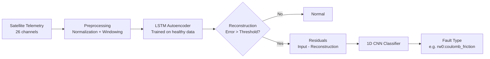

# Satellite Anomaly Detection

[](https://github.com/sachchit-vekaria/satellite-anomaly-detection/actions/workflows/ci.yml)
[](https://www.python.org/downloads/)
[](LICENSE)

An end-to-end pipeline for detecting and classifying anomalies in satellite subsystem telemetry using an **LSTM Autoencoder** for anomaly detection and a **1D CNN Classifier** for fault-type identification.

## Architecture



**Stage 1 -- Detection**: An LSTM autoencoder learns to reconstruct normal satellite telemetry. Windows with high reconstruction error are flagged as anomalous.

**Stage 2 -- Classification**: Reconstruction residuals from anomalous windows are fed into a 1D CNN that classifies the fault type and affected subsystem (3 reaction wheels + battery, 13 fault labels).

## Key Results

| Metric | Autoencoder | Classifier |
|--------|-------------|------------|
| Best Val Loss | 0.000130 | 0.3961 |
| Val Accuracy | -- | 88.93% |
| Epochs Trained | 100 | 10 |

See [`results/metrics.md`](results/metrics.md) for detailed per-label metrics.

## Project Structure

```
├── configs/                    YAML training configurations
├── docs/                       Technical documentation
├── notebooks/                  Training & exploration notebooks
│   ├── 01_data_exploration.ipynb
│   ├── 02_train_autoencoder.ipynb
│   └── 03_train_classifier.ipynb
├── src/sat_anomaly/            Installable Python package
│   ├── cli.py                  CLI entry point
│   ├── config.py               YAML config loader
│   ├── data/                   Loading, preprocessing, labeling
│   ├── models/                 Autoencoder, classifier, training
│   └── visualization/          Plotting utilities
├── tests/                      Pytest test suite
├── models/                     Pre-trained checkpoints (~3 MB)
└── results/                    Performance metrics & figures
```

## Quick Start

```bash
# Clone and install
git clone https://github.com/sachchit-vekaria/satellite-anomaly-detection.git
cd satellite-anomaly-detection
python -m venv .venv && source .venv/bin/activate
pip install -e ".[dev,notebooks]"

# Run tests
pytest tests/ -v

# Train autoencoder (requires data in data/)
sat-anomaly train-ae --config configs/autoencoder.yaml

# Train classifier (requires pretrained autoencoder)
sat-anomaly train-cls --config configs/classifier.yaml
```

## Usage

### CLI

```bash
# Train autoencoder
sat-anomaly train-ae --config configs/autoencoder.yaml

# Train classifier on residuals
sat-anomaly train-cls --config configs/classifier.yaml

# Merge raw channel CSVs into combined datasets
sat-anomaly merge-data --data-path data/raw/main_data/simulations_year
```

### Python API

```python
from sat_anomaly.models.autoencoder import LSTMAutoencoder
from sat_anomaly.models.training import load_model

# Load pre-trained autoencoder
model, checkpoint = load_model(
    "models/autoencoder_best.pth",
    model_class=LSTMAutoencoder,
    n_features=23, seq_len=256
)
```

### Notebooks

Interactive notebooks reproduce the full pipeline:

1. **`01_data_exploration.ipynb`** -- Data loading, statistics, and visualization
2. **`02_train_autoencoder.ipynb`** -- LSTM autoencoder training with reconstruction plots
3. **`03_train_classifier.ipynb`** -- 1D CNN classifier training on autoencoder residuals

## Data

The pipeline expects satellite simulation data under `data/` (gitignored). See [`docs/data_format.md`](docs/data_format.md) for the expected layout.

## Technical Approach

The two-stage approach is motivated by satellite dynamics:

- **Physics alignment**: LSTM/RNN cells naturally model state-space transitions in reaction wheel and power systems
- **Data efficiency**: The autoencoder trains only on healthy data (abundant), while the classifier operates on distilled residual features
- **Interpretability**: Reconstruction residuals provide physics-based anomaly scores comparable to Kalman filter residuals

See [`docs/architecture.md`](docs/architecture.md) for the full technical discussion.

## Development

```bash
make setup     # pip install -e ".[dev,notebooks]"
make test      # pytest tests/ -v
make lint      # ruff check src/ tests/
make format    # ruff format src/ tests/
make clean     # remove build artifacts
```

## License

[MIT](LICENSE)
